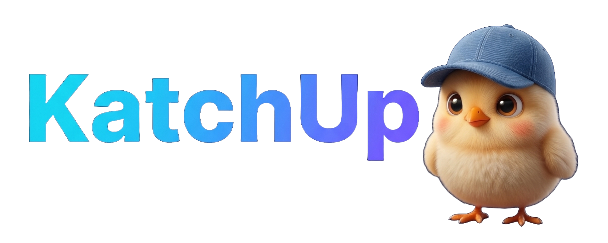
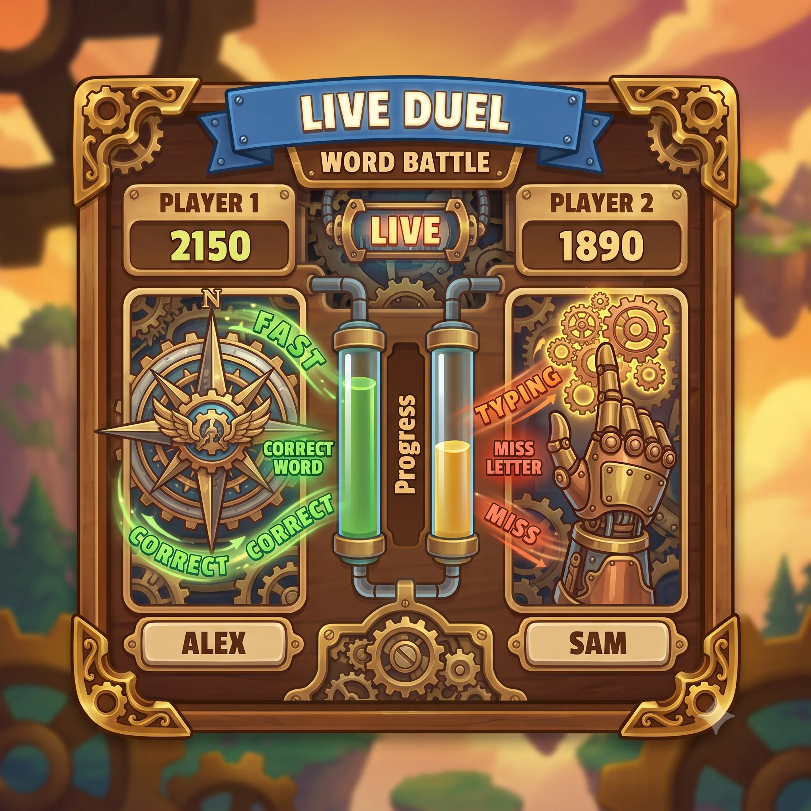
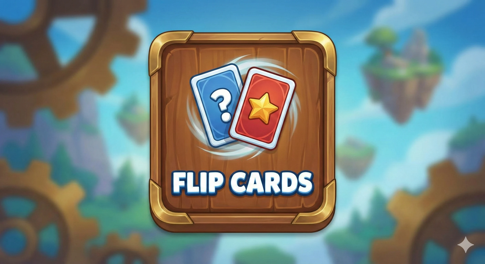
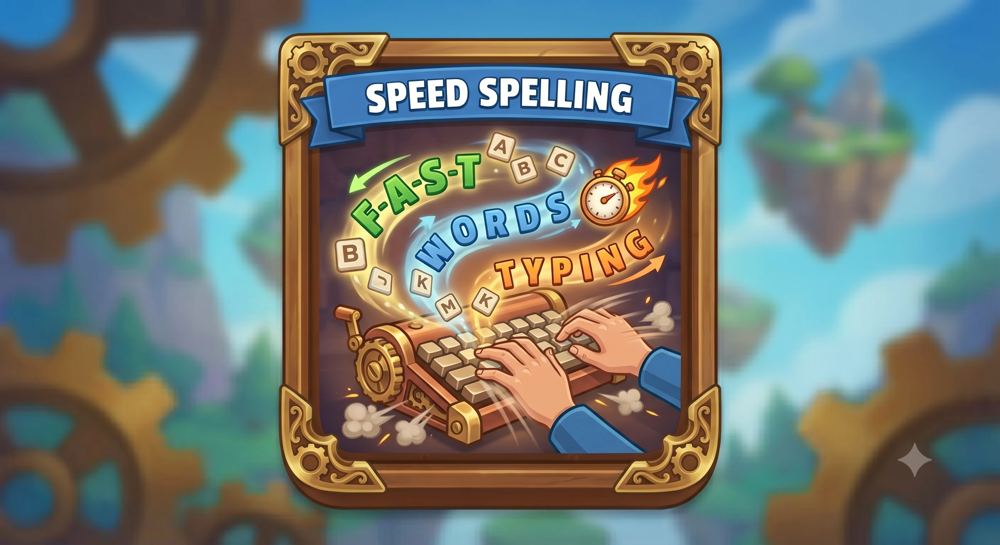
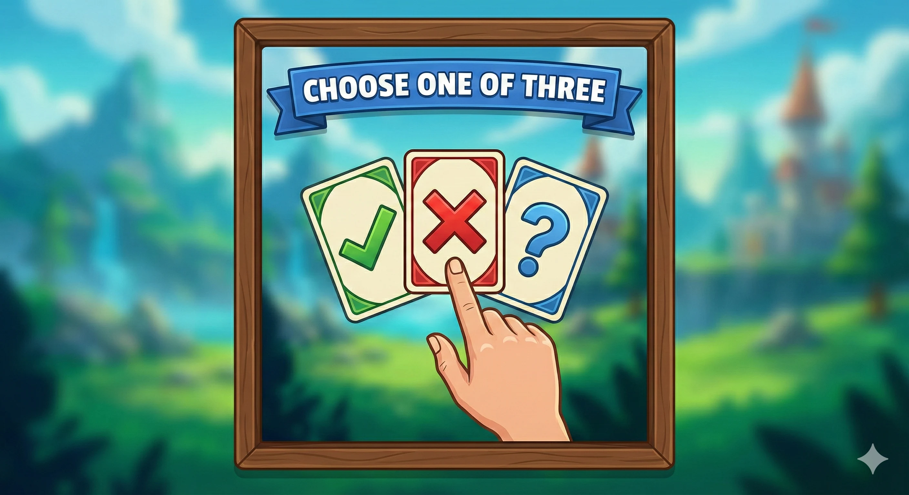
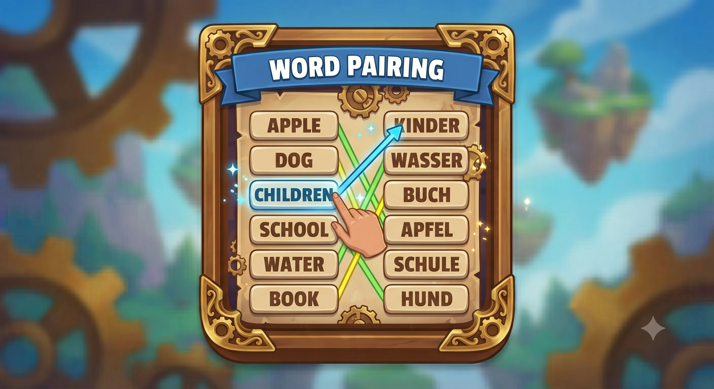
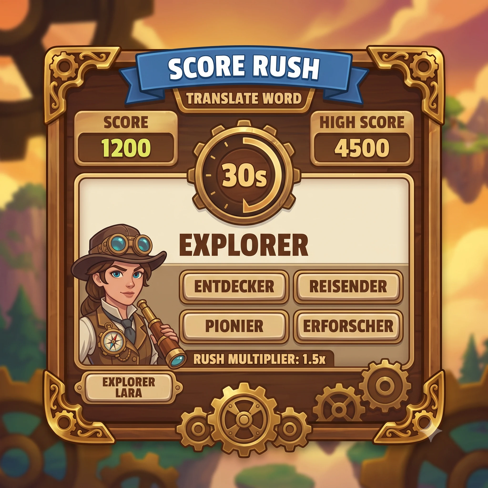

<p align="center">
  
</p>

# KatchUp

Learn words by playing. A multiplayer language-learning app — fast mini-games,
live duels, and vocabulary decks you can write yourself or have generated for you.

[katchup.jakubkuzel.com](https://katchup.jakubkuzel.com)

## What it is

Most vocab apps are a deck of flashcards with a streak counter bolted on. KatchUp
is built around playing against someone else instead — six game modes built on
the same word data, a live duel against a real opponent or a bot, and a
leaderboard that tracks it. Decks are yours to shape: add words by hand, import
a JSON list, or hand a topic to Gemini and get a deck back. It runs installed as
a PWA and still opens offline.

## Game modes

<table>
  <tr>
    <td width="33%"><p align="center"><sub><b>Live Duel</b> — real-time vs. an opponent or the bot</sub></p></td>
    <td width="33%"><p align="center"><sub><b>Flip Cards</b> — self-paced flashcards</sub></p></td>
    <td width="33%"><p align="center"><sub><b>Speed Spelling</b> — type it before time runs out</sub></p></td>
  </tr>
  <tr>
    <td width="33%"><p align="center"><sub><b>One of Three</b> — quick multiple-choice rounds</sub></p></td>
    <td width="33%"><p align="center"><sub><b>Word Pairing</b> — connect the synonyms</sub></p></td>
    <td width="33%"><p align="center"><sub><b>Score Rush</b> — 30 seconds, as many words as you can</sub></p></td>
  </tr>
</table>

## Features

- **Live Duel** — real-time head-to-head over WebSockets, against a matched
  opponent or a bot when no one's queuing
- **Six game modes** — One of Three, Flip Cards, Speed Spelling, Word Pairing,
  Score Rush, Live Duel — same words, different pace
- **Custom decks** — add words one at a time, bulk-import a JSON file, or
  generate a deck from a topic with Gemini
- **Leaderboards & friends** — wins, streaks, and progress tracked against
  people you actually know
- **Level test** to place new learners at a sensible difficulty instead of
  starting from zero
- **Google / GitHub / Discord sign-in**
- **Installable PWA** with an offline fallback page
- Optional rewarded ads (AdSense H5 Games) to top up energy instead of a
  paywall, plus a one-off Stripe-powered donation for anyone who wants to chip in

## Tech stack

- **Next.js 16** (App Router) + **React 19** + TypeScript
- **Tailwind CSS v4**
- **PostgreSQL** (Neon) via **Drizzle ORM**
- **NextAuth v5** (Google / GitHub / Discord)
- **Upstash Redis** — matchmaking state, caching
- **Pusher** — WebSocket channels for real-time duels
- **Google Gemini API** — AI deck generation
- **GSAP** + **Three.js** — page animations and a 3D mascot scene
- **Zustand** — client-side game state
- **Stripe** — donation checkout

### Architecture

Everything lives in one Next.js app — the `app/api/*` routes are the backend,
there's no separate server. Auth writes straight to Postgres through the
Drizzle adapter. A duel goes: queue for a match (state kept in Redis) → once
paired, both clients join a Pusher channel keyed by match ID → moves broadcast
over that channel instead of polling. Games read from either the shared word
database or a player's own deck in Postgres; AI-generated decks are a
server-side call to Gemini that returns a structured word list. See
[DOCUMENTATION.md](./DOCUMENTATION.md) for the full schema and module breakdown.

## Running it locally

Requirements: Node 18+, a Postgres URL (Neon works), an Upstash Redis instance,
and a Pusher app.

```bash
git clone https://github.com/xxKuzi/KatchUp.git
cd KatchUp
npm install
cp .env.example .env.local   # fill in the values below
npm run db:generate && npm run db:push
npm run dev
```

Open [localhost:3000](http://localhost:3000).

**Required:** `DATABASE_URL`, `AUTH_SECRET`, `AUTH_URL`, `UPSTASH_REDIS_REST_URL` /
`UPSTASH_REDIS_REST_TOKEN`, `PUSHER_APP_ID` / `PUSHER_KEY` / `PUSHER_SECRET` /
`PUSHER_CLUSTER`, `NEXT_PUBLIC_PUSHER_KEY` / `NEXT_PUBLIC_PUSHER_CLUSTER`.

**Optional:** `AUTH_GOOGLE_ID`/`SECRET`, `AUTH_GITHUB_ID`/`SECRET`,
`AUTH_DISCORD_ID`/`SECRET` (sign-in providers), `GEMINI_API_KEY` (AI deck
generation), `STRIPE_SECRET_KEY` + `STRIPE_DONATION_PRICE_ID` (donations),
`NEXT_PUBLIC_ADSENSE_*` (rewarded ads — leave unset and the ad button just
doesn't show up).

## License

All rights reserved. This repository is shared for portfolio and viewing
purposes only — no permission is granted to use, copy, modify, or distribute
it. See [LICENSE](./LICENSE).
